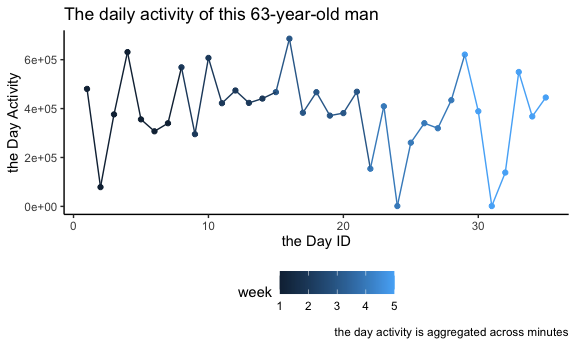

p8015_hw3_ax2173
================

``` r
library(tidyverse)
```

    ## ── Attaching packages ─────────────────────────────────────── tidyverse 1.3.2 ──
    ## ✔ ggplot2 3.3.6      ✔ purrr   0.3.4 
    ## ✔ tibble  3.1.8      ✔ dplyr   1.0.10
    ## ✔ tidyr   1.2.1      ✔ stringr 1.4.1 
    ## ✔ readr   2.1.2      ✔ forcats 0.5.2 
    ## ── Conflicts ────────────────────────────────────────── tidyverse_conflicts() ──
    ## ✖ dplyr::filter() masks stats::filter()
    ## ✖ dplyr::lag()    masks stats::lag()

``` r
knitr::opts_chunk$set(
  fig.width = 6,
  fig.asp = .6,
  out.width = '90%'
)

theme_set(theme_classic() + theme(legend.position = 'bottom'))

options(
  ggplot2.continous.colour = 'viridis_d',
  ggplot2.continous.fill = 'viridis_d'
)

scalr_colour_discrete = scale_color_viridis_d
scale_fill_discrete = scale_fill_viridis_d
```

## Problem 1

## Problem 2

Import, clean and manipulate data.

``` r
acc_df = 
  read_csv("./Data/accel_data.csv") %>% 
  janitor::clean_names() %>% 
  mutate(
    weekday_or_weekend = ifelse((day == 'Saturday' | day == "Sunday"), 'Weekend', 'Weekday')
    ) %>% 
  pivot_longer(
    activity_1 : activity_1440,
    names_to = 'activity_num',
    values_to = 'activity_counts'
  ) %>% 
  select(week, day_id, day, weekday_or_weekend, everything())
```

    ## Rows: 35 Columns: 1443
    ## ── Column specification ────────────────────────────────────────────────────────
    ## Delimiter: ","
    ## chr    (1): day
    ## dbl (1442): week, day_id, activity.1, activity.2, activity.3, activity.4, ac...
    ## 
    ## ℹ Use `spec()` to retrieve the full column specification for this data.
    ## ℹ Specify the column types or set `show_col_types = FALSE` to quiet this message.

-   There are some descriptions:
    -   This dataset contains these variables: week, day_id, day,
        weekday_or_weekend, activity_num, activity_counts
    -   There are totally 50400 observations
    -   There are totally 6 variables

Aggregate across minutes to create a total activity variable for each
day, and create a table to show these totals.

``` r
acc_df %>% 
  group_by(week, day_id, day) %>% 
  summarize(day_activity = sum(activity_counts)) %>% 
  knitr::kable(digits = 2)
```

    ## `summarise()` has grouped output by 'week', 'day_id'. You can override using
    ## the `.groups` argument.

| week | day_id | day       | day_activity |
|-----:|-------:|:----------|-------------:|
|    1 |      1 | Friday    |    480542.62 |
|    1 |      2 | Monday    |     78828.07 |
|    1 |      3 | Saturday  |    376254.00 |
|    1 |      4 | Sunday    |    631105.00 |
|    1 |      5 | Thursday  |    355923.64 |
|    1 |      6 | Tuesday   |    307094.24 |
|    1 |      7 | Wednesday |    340115.01 |
|    2 |      8 | Friday    |    568839.00 |
|    2 |      9 | Monday    |    295431.00 |
|    2 |     10 | Saturday  |    607175.00 |
|    2 |     11 | Sunday    |    422018.00 |
|    2 |     12 | Thursday  |    474048.00 |
|    2 |     13 | Tuesday   |    423245.00 |
|    2 |     14 | Wednesday |    440962.00 |
|    3 |     15 | Friday    |    467420.00 |
|    3 |     16 | Monday    |    685910.00 |
|    3 |     17 | Saturday  |    382928.00 |
|    3 |     18 | Sunday    |    467052.00 |
|    3 |     19 | Thursday  |    371230.00 |
|    3 |     20 | Tuesday   |    381507.00 |
|    3 |     21 | Wednesday |    468869.00 |
|    4 |     22 | Friday    |    154049.00 |
|    4 |     23 | Monday    |    409450.00 |
|    4 |     24 | Saturday  |      1440.00 |
|    4 |     25 | Sunday    |    260617.00 |
|    4 |     26 | Thursday  |    340291.00 |
|    4 |     27 | Tuesday   |    319568.00 |
|    4 |     28 | Wednesday |    434460.00 |
|    5 |     29 | Friday    |    620860.00 |
|    5 |     30 | Monday    |    389080.00 |
|    5 |     31 | Saturday  |      1440.00 |
|    5 |     32 | Sunday    |    138421.00 |
|    5 |     33 | Thursday  |    549658.00 |
|    5 |     34 | Tuesday   |    367824.00 |
|    5 |     35 | Wednesday |    445366.00 |

Let’s make a point plot to see whether there are any trends apparent.

-   I am not sure, but I guess the day activity is relatively lower in
    weekends than in weekdays.

``` r
acc_df %>% 
  group_by(week, day_id, day) %>% 
  summarize(day_activity = sum(activity_counts)) %>% 
  ggplot(aes(x = day_id, y = day_activity)) +
  geom_line() +
  labs(
    title = 'The daily activity of this 63-year-old man',
    x = 'the day ID',
    y = 'the day activity',
    caption = 'the day activity is aggregated across minutes'
  )
```

    ## `summarise()` has grouped output by 'week', 'day_id'. You can override using
    ## the `.groups` argument.



## Problem 3
