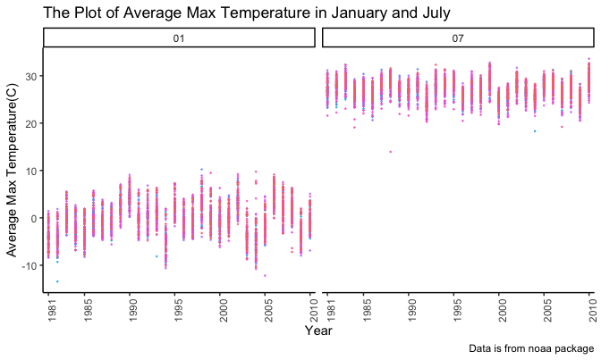
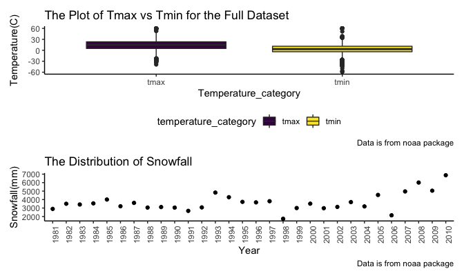

p8015_hw3_ax2173
================

``` r
library(tidyverse)
```

    ## ── Attaching packages ─────────────────────────────────────── tidyverse 1.3.2 ──
    ## ✔ ggplot2 3.3.6      ✔ purrr   0.3.4 
    ## ✔ tibble  3.1.8      ✔ dplyr   1.0.10
    ## ✔ tidyr   1.2.1      ✔ stringr 1.4.1 
    ## ✔ readr   2.1.2      ✔ forcats 0.5.2 
    ## ── Conflicts ────────────────────────────────────────── tidyverse_conflicts() ──
    ## ✖ dplyr::filter() masks stats::filter()
    ## ✖ dplyr::lag()    masks stats::lag()

``` r
knitr::opts_chunk$set(
  fig.width = 6,
  fig.asp = .6,
  out.width = '90%'
)

theme_set(theme_classic() + theme(legend.position = 'bottom'))

options(
  ggplot2.continous.colour = 'viridis_d',
  ggplot2.continous.fill = 'viridis_d'
)

scalr_colour_discrete = scale_color_viridis_d
scale_fill_discrete = scale_fill_viridis_d
```

## Problem 1

Import the required data.

``` r
library(p8105.datasets)
data("instacart")
```

-   There are some descriptions about the data:
    -   The size of this dataset is 1384617 x 15
    -   This dataset had these variables: order_id, product_id,
        add_to_cart_order, reordered, user_id, eval_set, order_number,
        order_dow, order_hour_of_day, days_since_prior_order,
        product_name, aisle_id, department_id, aisle, department

How many aisles are there, and which aisles are the most items ordered
from?

``` r
instacart %>% 
  summarize(aisle_count = n_distinct(aisle_id))
```

    ## # A tibble: 1 × 1
    ##   aisle_count
    ##         <int>
    ## 1         134

``` r
instacart %>% 
  group_by(aisle) %>% 
  summarize(aisle_cal = n()) %>% 
  mutate(aisle_rank = min_rank(desc(aisle_cal))) %>% 
  arrange(desc(aisle_cal))
```

    ## # A tibble: 134 × 3
    ##    aisle                         aisle_cal aisle_rank
    ##    <chr>                             <int>      <int>
    ##  1 fresh vegetables                 150609          1
    ##  2 fresh fruits                     150473          2
    ##  3 packaged vegetables fruits        78493          3
    ##  4 yogurt                            55240          4
    ##  5 packaged cheese                   41699          5
    ##  6 water seltzer sparkling water     36617          6
    ##  7 milk                              32644          7
    ##  8 chips pretzels                    31269          8
    ##  9 soy lactosefree                   26240          9
    ## 10 bread                             23635         10
    ## # … with 124 more rows

The most items ordered from is fresh vegetables.

Then, show the three most popular items in aisles.

``` r
instacart %>% 
  filter(aisle %in% c("baking ingredients", "dog food care", "packaged vegetables fruits")) %>%
  group_by(aisle) %>% 
  count(product_name) %>% 
  mutate(rank = min_rank(desc(n))) %>% 
  filter(rank < 4) %>% 
  arrange(desc(n)) %>%
  knitr::kable()
```

| aisle                      | product_name                                  |    n | rank |
|:---------------------------|:----------------------------------------------|-----:|-----:|
| packaged vegetables fruits | Organic Baby Spinach                          | 9784 |    1 |
| packaged vegetables fruits | Organic Raspberries                           | 5546 |    2 |
| packaged vegetables fruits | Organic Blueberries                           | 4966 |    3 |
| baking ingredients         | Light Brown Sugar                             |  499 |    1 |
| baking ingredients         | Pure Baking Soda                              |  387 |    2 |
| baking ingredients         | Cane Sugar                                    |  336 |    3 |
| dog food care              | Snack Sticks Chicken & Rice Recipe Dog Treats |   30 |    1 |
| dog food care              | Organix Chicken & Brown Rice Recipe           |   28 |    2 |
| dog food care              | Small Dog Biscuits                            |   26 |    3 |

Showing the mean hour of the day at which Pink Lady Apples and Coffee
Ice Cream are ordered on each day of the week. This table has been
formatted in an untidy manner for human readers. Pink Lady Apples are
generally purchased slightly earlier in the day than Coffee Ice Cream,
with the exception of day 5.

``` r
instacart %>%
  filter(product_name %in% c("Pink Lady Apples", "Coffee Ice Cream")) %>%
  group_by(product_name, order_dow) %>%
  summarize(mean_hour = mean(order_hour_of_day)) %>%
  spread(key = order_dow, value = mean_hour) %>%
  knitr::kable(digits = 2)
```

    ## `summarise()` has grouped output by 'product_name'. You can override using the
    ## `.groups` argument.

| product_name     |     0 |     1 |     2 |     3 |     4 |     5 |     6 |
|:-----------------|------:|------:|------:|------:|------:|------:|------:|
| Coffee Ice Cream | 13.77 | 14.32 | 15.38 | 15.32 | 15.22 | 12.26 | 13.83 |
| Pink Lady Apples | 13.44 | 11.36 | 11.70 | 14.25 | 11.55 | 12.78 | 11.94 |

## Problem 2

Import, clean and manipulate data.

``` r
acc_df = 
  read_csv("./Data/accel_data.csv") %>% 
  janitor::clean_names() %>% 
  mutate(
    weekday_or_weekend = ifelse((day == 'Saturday' | day == "Sunday"), 'Weekend', 'Weekday')
    ) %>% 
  pivot_longer(
    activity_1 : activity_1440,
    names_to = 'activity_num',
    values_to = 'activity_counts'
  ) %>% 
  select(week, day_id, day, weekday_or_weekend, everything())
```

    ## Rows: 35 Columns: 1443
    ## ── Column specification ────────────────────────────────────────────────────────
    ## Delimiter: ","
    ## chr    (1): day
    ## dbl (1442): week, day_id, activity.1, activity.2, activity.3, activity.4, ac...
    ## 
    ## ℹ Use `spec()` to retrieve the full column specification for this data.
    ## ℹ Specify the column types or set `show_col_types = FALSE` to quiet this message.

-   There are some descriptions:
    -   This dataset contains these variables: week, day_id, day,
        weekday_or_weekend, activity_num, activity_counts
    -   There are totally 50400 observations
    -   There are totally 6 variables

Aggregate across minutes to create a total activity variable for each
day, and create a table to show these totals.

-   As for any trends apparent, I am not sure, but I guess the day
    activity is relatively lower in weekends than in weekdays.

``` r
acc_df %>% 
  group_by(week, day_id, day) %>% 
  summarize(day_activity = sum(activity_counts)) %>% 
  knitr::kable(digits = 2)
```

    ## `summarise()` has grouped output by 'week', 'day_id'. You can override using
    ## the `.groups` argument.

| week | day_id | day       | day_activity |
|-----:|-------:|:----------|-------------:|
|    1 |      1 | Friday    |    480542.62 |
|    1 |      2 | Monday    |     78828.07 |
|    1 |      3 | Saturday  |    376254.00 |
|    1 |      4 | Sunday    |    631105.00 |
|    1 |      5 | Thursday  |    355923.64 |
|    1 |      6 | Tuesday   |    307094.24 |
|    1 |      7 | Wednesday |    340115.01 |
|    2 |      8 | Friday    |    568839.00 |
|    2 |      9 | Monday    |    295431.00 |
|    2 |     10 | Saturday  |    607175.00 |
|    2 |     11 | Sunday    |    422018.00 |
|    2 |     12 | Thursday  |    474048.00 |
|    2 |     13 | Tuesday   |    423245.00 |
|    2 |     14 | Wednesday |    440962.00 |
|    3 |     15 | Friday    |    467420.00 |
|    3 |     16 | Monday    |    685910.00 |
|    3 |     17 | Saturday  |    382928.00 |
|    3 |     18 | Sunday    |    467052.00 |
|    3 |     19 | Thursday  |    371230.00 |
|    3 |     20 | Tuesday   |    381507.00 |
|    3 |     21 | Wednesday |    468869.00 |
|    4 |     22 | Friday    |    154049.00 |
|    4 |     23 | Monday    |    409450.00 |
|    4 |     24 | Saturday  |      1440.00 |
|    4 |     25 | Sunday    |    260617.00 |
|    4 |     26 | Thursday  |    340291.00 |
|    4 |     27 | Tuesday   |    319568.00 |
|    4 |     28 | Wednesday |    434460.00 |
|    5 |     29 | Friday    |    620860.00 |
|    5 |     30 | Monday    |    389080.00 |
|    5 |     31 | Saturday  |      1440.00 |
|    5 |     32 | Sunday    |    138421.00 |
|    5 |     33 | Thursday  |    549658.00 |
|    5 |     34 | Tuesday   |    367824.00 |
|    5 |     35 | Wednesday |    445366.00 |

Make a single-panel plot that shows the 24-hour activity time courses
for each day and use color to indicate day of the week.

``` r
acc_df %>% 
  separate(activity_num, into = c('activity','second'), sep = "_") %>% 
  mutate(second = as.numeric(second),
    time = round(second/60,2)) %>% 
  select(-activity, -second) %>% 
  group_by(time, day) %>% 
  summarize(day_activity = sum(activity_counts)) %>% 
  ggplot(aes(x = time, y = day_activity, color = day)) +
  geom_point(alpha = 0.1, size = 0.5) +
  labs(
    title = 'The Daily Activity of This 63-year-old Man',
    x = 'Time',
    y = 'the Day Activity',
    caption = 'the day activity is aggregated across day'
  ) +
  scale_x_continuous(
    breaks = c(0, 3, 6, 9, 12, 15, 18, 21, 24)
  ) 
```

    ## `summarise()` has grouped output by 'time'. You can override using the
    ## `.groups` argument.


-   About some patterns or conclusions I can make based on this graph.
    -   A huge fluctuation can be found during the whole process
    -   The highest data was in the Monday of week 3, reaching 685920.00
    -   The lowest data appeared both in Saturday in week 4 and Saturday
        in week 5, with daily activity data of just 1440.00

## Problem 3

Download the needed data.

``` r
library(p8105.datasets)
data("ny_noaa")
```

-   There are some descriptions about the data:
    -   The size of this dataset is 2595176 x 7
    -   This dataset had these variables: id, date, prcp, snow, snwd,
        tmax, tmin
    -   Almost all the data in this dataset are missing, in other words,
        the extend of missing value is huge (I guess).

Next, do the data cleaning and create separate variables for year, month
and day, and make sure that temperature, precipitation and snow fall are
given in reasonable units.

``` r
ny_noaa = 
  ny_noaa %>% 
  janitor::clean_names() %>% 
  mutate(
    tmax = as.double(tmax),
    tmax = tmax/10,
    tmin = as.double(tmin),
    tmin = tmin/10,
    prcp = prcp/10,
    snow = snow/100
    ) %>% 
  separate(date, into = c('year', 'month',  'day'), sep = '-')
```

Calculate the most commonly observed values about snowfall. \* From the
density plot, we can know that the most commonly observed values about
snowfall is 0.

``` r
ny_noaa %>% 
  group_by(snow) %>% 
    summarize(snowfall_count = n()) %>% 
  ggplot(aes(x = snow)) +
  geom_density() +
    labs(
    title = 'The Plot of Snowfall Data',
    x = 'Snowfall(mm)',
    y = 'Snowfall Count',
    caption = 'Data is from noaa package'
  )
```

    ## Warning: Removed 1 rows containing non-finite values (stat_density).


Make a two-panel plot showing the average max temperature in January and
in July in each station across years. \* The median of average of max
temperature in January is around 0 C, and that of July is around 26C. \*
The data in January is spread more wider than that of July. \* Both of
these data of two months have outliers: four for January and three for
July.

``` r
ny_noaa %>% 
  filter(month == '01' | month == '07')  %>% 
  group_by(id, month) %>% 
    summarize(average_tmax = mean(tmax, na.rm = TRUE)) %>% 
  ggplot(aes(x = month, y = average_tmax, fill = month)) +
  geom_boxplot() +
  labs(
    title = 'The Plot of Average Max Temperature in January and July',
    x = 'Month',
    y = 'Average Max Temperature(C)',
    caption = 'Data is from noaa package')
```

    ## `summarise()` has grouped output by 'id'. You can override using the `.groups`
    ## argument.

    ## Warning: Removed 876 rows containing non-finite values (stat_boxplot).



Make a two-panel plot showing tmax vs tmin for the full dataset \* The
median of max temperature is around 15 C, and the median of min
temperature is around 3 C. \* The data in tmin is spread more wider than
that of tmax. \* Both of these data many have outliers.

``` r
ny_noaa %>% 
  pivot_longer(
    tmax : tmin,
    names_to = 'temperature_category',
    values_to = 'temperature'
  ) %>% 
  ggplot(aes(x = temperature_category, y = temperature, fill = temperature_category)) +
  geom_boxplot()  +
  labs(
    title = 'The Plot of Tmax vs Tmin for the Full Dataset',
    x = 'Temperature Category',
    y = 'Temperature(C)',
    caption = 'Data is from noaa package')
```

    ## Warning: Removed 2268778 rows containing non-finite values (stat_boxplot).



Make a plot showing the distribution of snowfall values greater than 0
and less than 100 separately by year.

``` r
ny_noaa %>% 
  filter(snow > 0 & snow <100) %>% 
  group_by(year) %>% 
    summarize(snowfall = sum(snow, na.rm = TRUE)) %>% 
  ggplot(aes(x = year, y = snowfall)) + 
  geom_point() +
  labs(
    title = 'The Distribution of Snowfall',
    x = 'Year',
    y = 'Snowfall(mm)',
    caption = 'Data is from noaa package'
  )
```


